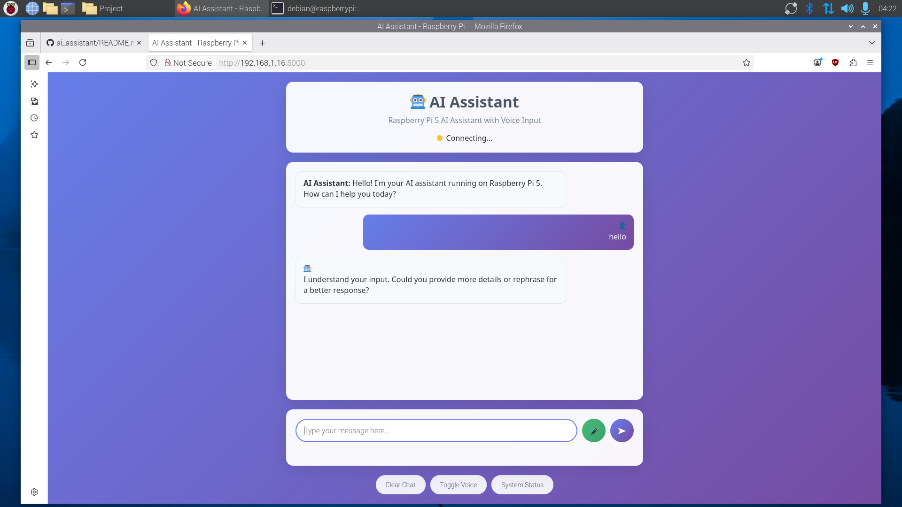
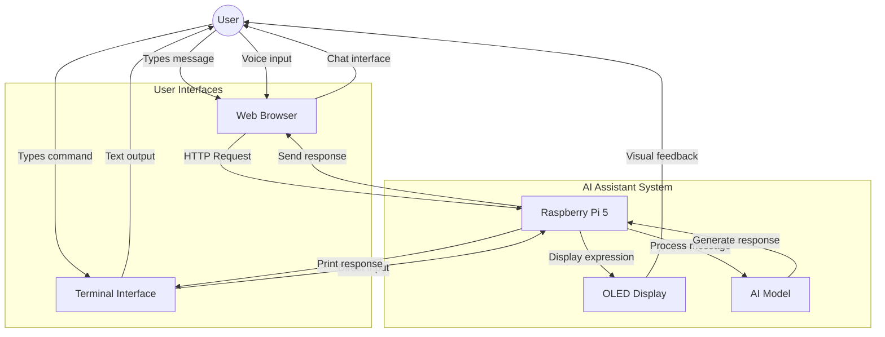

# 🤖 AI ASSISTANT FOR RASPBERRY PI 5

<p align="center">
  
</p>

<p align="center">
  <em>Sistem AI Assistant komprehensif yang berjalan di Raspberry Pi 5 dengan multiple interface: web browser, terminal, dan ekspresi OLED display.</em>
</p>

<p align="center">
  
  
  
  
  
  
  
  <a href="https://github.com/your-username/raspberry-pi-ai-assistant/blob/main/LICENSE">
    
  </a>
</p>

---

A comprehensive AI Assistant project that runs on Raspberry Pi 5 with multiple interfaces: web browser, terminal, and OLED display expressions.

## Features

### 🤖 AI Integration
- Lightweight AI model (DistilGPT-2) from Hugging Face
- Offline capability with local model caching
- Fallback responses when model is unavailable

### 🖥️ Multiple Interfaces
- **Web Interface**: Modern chat UI with voice input support
- **Terminal Interface**: Command-line chat experience
- **OLED Display**: Animated facial expressions (128x64 SSD1306)

### 🎤 Voice Input
- Browser-based speech-to-text
- Real-time voice recognition
- Visual feedback during recording

### 📱 OLED Expressions
- **Idle**: Normal eyes, straight mouth
- **Listening**: Normal eyes, straight mouth
- **Thinking**: Blinking eyes with dots
- **Speaking**: Normal eyes, smiling mouth

## Use Case Diagram



### System Interactions

| Actor | Use Cases | Description |
|-------|-----------|-------------|
| **User** | Chat via Web | Access web interface, send messages, receive responses |
| **User** | Chat via Terminal | Use command-line interface for direct interaction |
| **User** | Voice Input | Speak to microphone through web browser |
| **Raspberry Pi** | Process Messages | Handle requests, manage AI model, coordinate responses |
| **AI Model** | Generate Responses | Process user input and generate intelligent replies |
| **OLED Display** | Show Expressions | Display facial expressions based on system state |
| **Web Browser** | Provide Interface | Render chat UI, handle voice input, display responses |
| **Terminal** | Command Interface | Accept text input, display AI responses |

## Hardware Requirements

- Raspberry Pi 5 (4GB+ RAM recommended)
- 128x64 OLED Display (SSD1306)
- Microphone (for voice input via web browser)
- MicroSD card (32GB+ recommended)

## Software Requirements

- Raspberry Pi OS (64-bit recommended)
- Python 3.9+
- Internet connection (for initial model download)

## Installation

### 1. Clone or Download Project
```bash
# If using git
git clone <your-repo-url>
cd raspberry-pi-ai-assistant

# Or download and extract the ZIP file
```

### 2. Run Setup Script
```bash
chmod +x setup.sh
./setup.sh
```

### 3. Manual Installation (Alternative)
```bash
# Update system
sudo apt update && sudo apt upgrade -y

# Install system dependencies
sudo apt install -y python3-pip python3-venv git

# Install I2C tools for OLED
sudo apt install -y i2c-tools

# Enable I2C interface
sudo raspi-config
# Navigate to: Interface Options > I2C > Enable

# Create virtual environment
python3 -m venv ai_assistant_env
source ai_assistant_env/bin/activate

# Install Python dependencies
pip install -r requirements.txt

# Test OLED connection (optional)
sudo i2cdetect -y 1
```

## Hardware Setup

### OLED Display Wiring (SSD1306 128x64)
```
OLED Pin  ->  Raspberry Pi Pin
VCC       ->  3.3V (Pin 1)
GND       ->  Ground (Pin 6)
SDA       ->  GPIO 2 (Pin 3)
SCL       ->  GPIO 3 (Pin 5)
```

### Enable I2C
```bash
sudo raspi-config
# Interface Options > I2C > Enable
sudo reboot
```

## Usage

### Start the AI Assistant
```bash
# Activate virtual environment
source ai_assistant_env/bin/activate

# Run the application
python app.py
```

### Access Methods

1. **Web Interface**
   - Open browser: `http://localhost:5000`
   - From other devices: `http://[PI_IP_ADDRESS]:5000`
   - Features: Chat, voice input, system status

2. **Terminal Interface**
   - Automatically starts with the Flask app
   - Type messages directly in terminal
   - Type 'quit' or 'exit' to stop

3. **OLED Display**
   - Shows expressions automatically
   - Idle -> Listening -> Thinking -> Speaking -> Idle

### Voice Input (Web Interface)
1. Click the microphone button
2. Speak your message
3. Message will be automatically sent
4. Toggle voice on/off with control button

## Configuration

### Model Configuration
- Default model: `distilgpt2` (lightweight)
- Models cached in: `./models/`
- Change model in `app.py`:
```python
model_name = "distilgpt2"  # Change to other compatible models
```

### OLED Configuration
- Default size: 128x64
- I2C address: 0x3C
- Modify in `oled_display.py` if needed

### Network Configuration
- Default host: `0.0.0.0` (accessible from network)
- Default port: `5000`
- Change in `app.py` if needed

## Troubleshooting

### Common Issues

**1. OLED Display Not Working**
```bash
# Check I2C connection
sudo i2cdetect -y 1
# Should show device at 0x3C

# Check I2C is enabled
sudo raspi-config
# Interface Options > I2C > Enable
```

**2. AI Model Loading Slowly**
- First run downloads ~250MB model
- Subsequent runs use cached model
- Ensure stable internet connection

**3. Voice Input Not Working**
- Use HTTPS or localhost only
- Check browser microphone permissions
- Ensure microphone is connected

**4. Permission Errors**
```bash
# Fix GPIO permissions
sudo usermod -a -G gpio $USER
sudo usermod -a -G i2c $USER
# Logout and login again
```

**5. Memory Issues**
- Use Raspberry Pi 5 with 4GB+ RAM
- Close unnecessary applications
- Consider using lighter AI model

### Performance Tips

1. **Optimize for Raspberry Pi**
   - Use 64-bit Raspberry Pi OS
   - Enable GPU memory split: `sudo raspi-config` > Advanced > Memory Split > 128

2. **Improve AI Response Time**
   - Keep model in memory (default behavior)
   - Use SSD instead of SD card for better I/O
   - Increase swap file if needed

3. **Network Performance**
   - Use wired connection for better stability
   - Configure static IP for consistent access

## File Structure

```
raspberry-pi-ai-assistant/
├── app.py                 # Main Flask application
├── oled_display.py        # OLED display controller
├── requirements.txt       # Python dependencies
├── setup.sh              # Installation script
├── README.md             # This file
├── templates/
│   └── index.html        # Web interface template
├── static/
│   ├── style.css         # Web interface styles
│   └── script.js         # Web interface JavaScript
├── models/               # AI models cache (created automatically)
└── data/                 # Optional chat data storage
```

## API Endpoints

- `GET /` - Web interface
- `POST /chat` - Send message, get AI response
- `GET /history` - Get chat history
- `GET /status` - Get system status

## Development

### Adding New Features
1. Modify `app.py` for backend changes
2. Update templates/static files for UI changes
3. Extend `oled_display.py` for new expressions

### Custom AI Models
1. Replace model name in `app.py`
2. Ensure model is compatible with transformers library
3. Test memory usage on Raspberry Pi

## License

This project is open source. Feel free to modify and distribute.

## Support

For issues and questions:
1. Check troubleshooting section
2. Verify hardware connections
3. Check system logs: `journalctl -f`

## Contributing

Contributions welcome! Please test on Raspberry Pi 5 before submitting.

---
<div align="center">

**⭐ Star this repo if you like it!**

<p><a href="#top">⬆ Back on Top</a></p>
</div>
